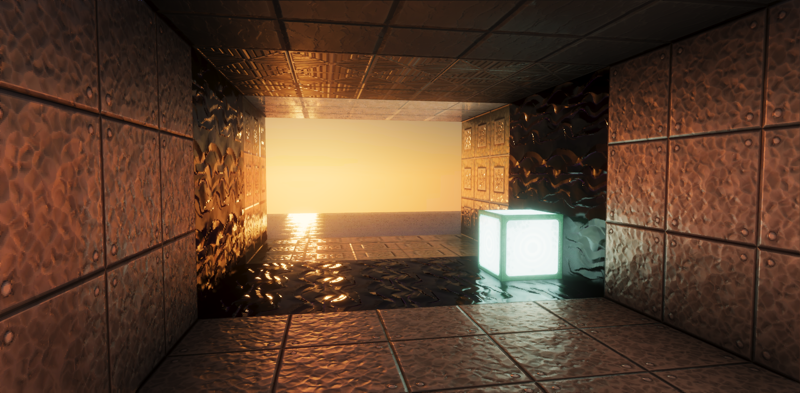

# A vanilla shaderpack

My attempt to create a decent looking shader using the vanilla pipeline.

Features:
- Screen-space AO
- Shadow mapping
- Volumetric fog
- Atmospheric scattering
- Bloom
- Screen-space reflections
- PBR material support: smoothness, normal mapping, ao, emissiveness, reflectance, sss, generic metals.
- Temporal AA
- Directional lightmap
- Water waves

## Screenshots

